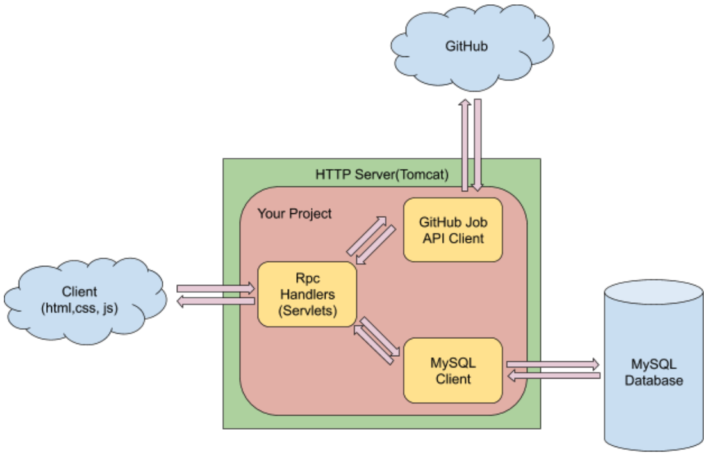

# AWS-based Job Search and Recommendation Engine

A web application for users to search open positions based on location and preference.

Job search and recommendation web application deployed on AWS EC2. Implemented RESTful APIs using Java servlets, which include register/login/logout, search, and recommend three parts.

Job is a AWS-based web application which aims to let users search for jobs nearby and can also provide users with personalized job recommendation based on search history, preference and geo-location.

### Architecture

### Functionality

1. Users can either log in to an existing account or register as a new user on the home page.
2. Once logged in as a user, you will see new open positions in your area, and you can click on a job posting to favorite the position. All favorited items will be kept on the history page and saved in the database.
3. The application will list new open positions based on your previously favored items on the recommended page.
4. Utilized GitHub Jobs API for job searching,  extracted users' favorite job keywords through MonkeyLearn API, and recommended relevant jobs.

